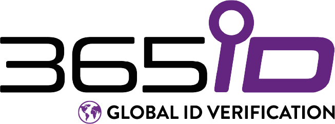

### Hur det går till när man söker jobb hos 365id

Jag sökte nyligen ett jobb som utvecklare hos 365id.

Stämningen var inledningsvis väldigt positiv, jag besökte företaget för att träffa teamet; sedan hände absolut ingenting.

När jag till slut hörde av mig och bad om en statusuppdatering så fick jag veta att man hade pratat med någon bakom min rygg som hade sagt något som inte var positivt. Man hade inte brytt sig om att förankra det, och kunde inte låta mig veta vad som hade sagts eller av vem så att kunde bemöta det. Referensen jag lämnade brydde man sig inte ens om att kontakta.

Jag tar fullt ansvar för vad jag har gjort och är väl medveten om att jag har trampat en och annan person på tårna längs vägen, det har väl i princip varenda människa som någonsin har stått upp för något i sitt arbetsliv; och vill man använda det som argument för att inte anställa mig så är det egentligen inte mitt problem.

Men jag känner att jag har ett ansvar att varna andra intresserade, innan de slösar bort sin tid och energi på ett företag där man verkar bry sig mer om skvaller än kompetens och är oförmögna att ta ansvar för sina handlingar. Jag kan tillägga att jag gav företagets CEO flera chanser att lösa det här på ett bättre sätt.

Min rekommendation: leta efter något bättre!
